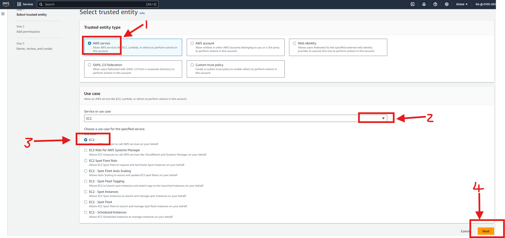
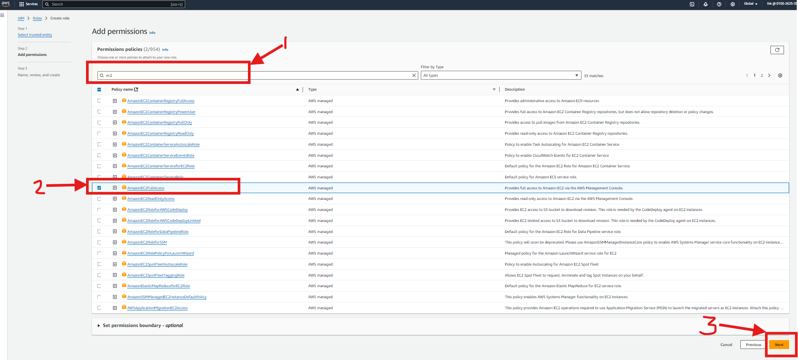
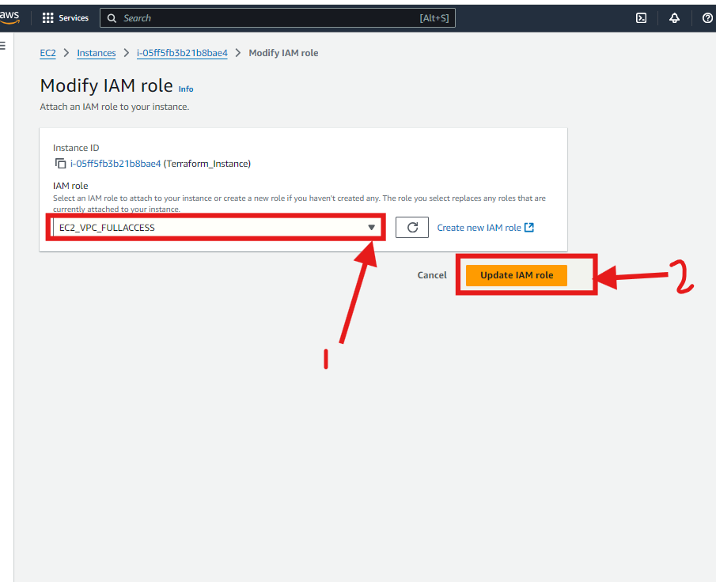
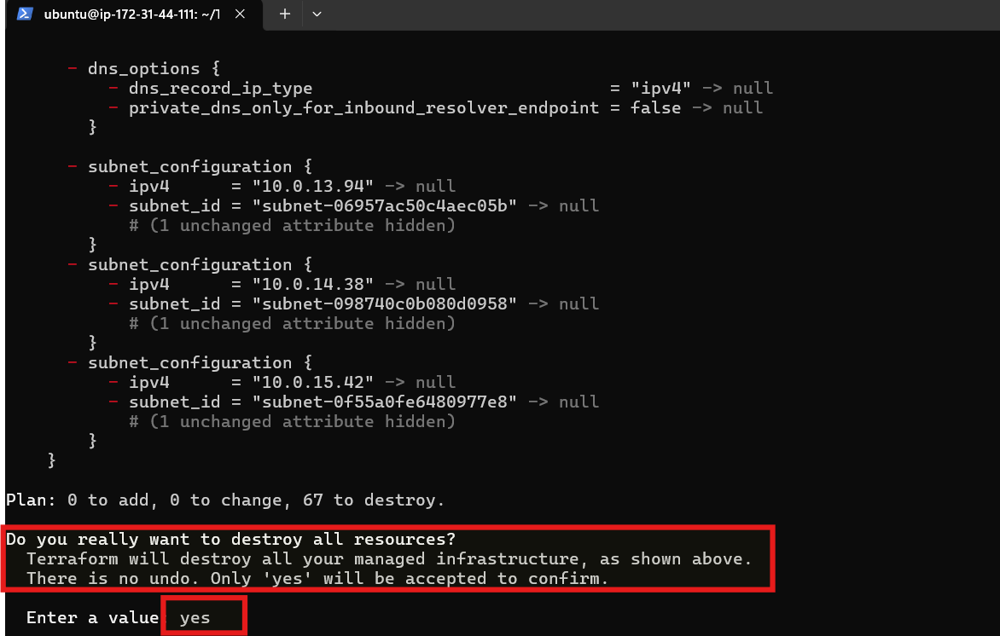

# Project 8 - AWS VPC using Terraform

In project 7,  VPC, subnets, route tables, and other services in AWS were manually created which can be time consumming, tediuos and and error-prone.

Automation therefore is the way to go and this is where Terraform comes in.

It is a popular IaC tool developed by HashiCorp that allows users to define, provision, and manage infrastructure across various cloud providers and services using a high-level configuration language.

## Steps to execute project 8:

- Leveraging on experiences from projects 1 and 2, I spinned 2 EC2 instances and attach the following IAM roles:

** AmazonVPCFullAccess
** AmazonEC2FullAccess

The steps for this are as shown below:

- I then created the EC2 instance (Ubuntu) and attached the role created earlier to the instance as shown below:

- To install terraform,  I 'SSH' into the instance and ran the command shown below:

- I used the command shown below to clone the repo into the instance and then CD in the cloned repository:

- To initialize Terraform, execute the plan and create VPC with Terraform, I ran the commands shown below:

To validate the created VPC, I refreshed my AWS console, clicked on the created VPC and scroll down to view the Resource Map as shown below:

## To clean-up the Resources created by Terraform, i executed the command as shown below: 

End of Project8

